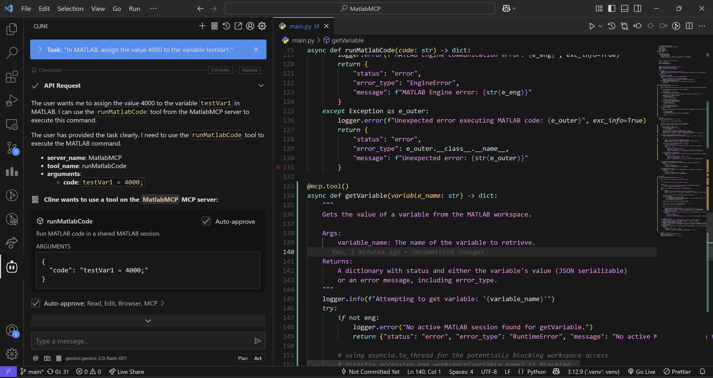
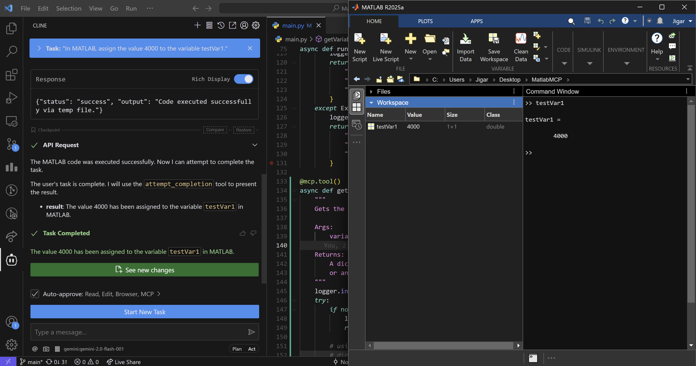
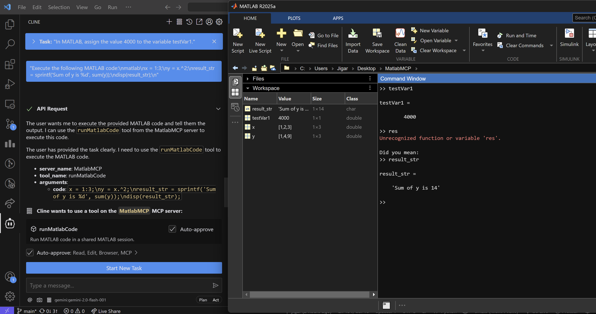
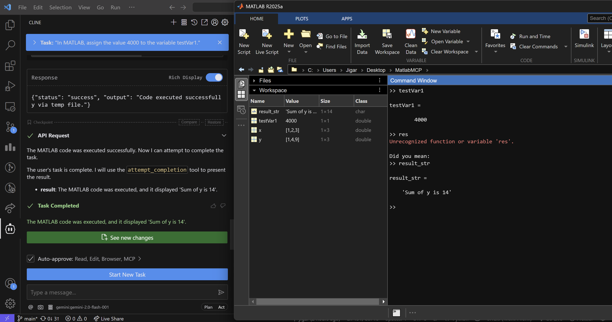
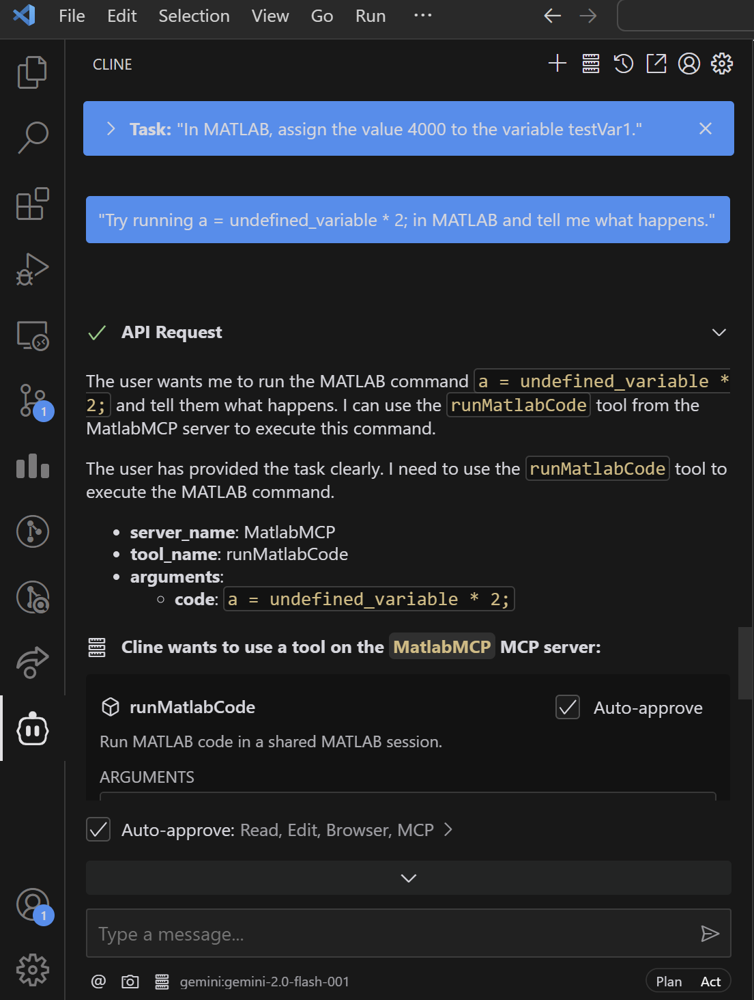
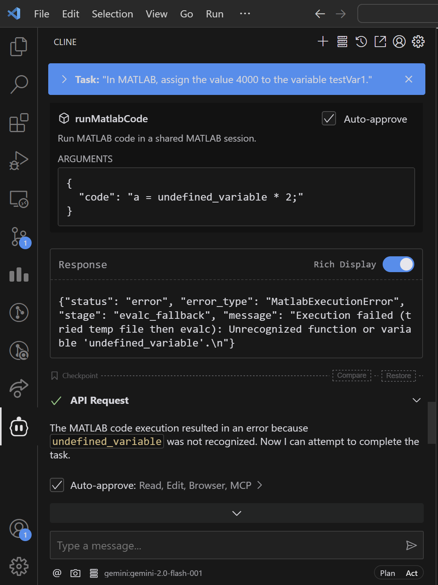
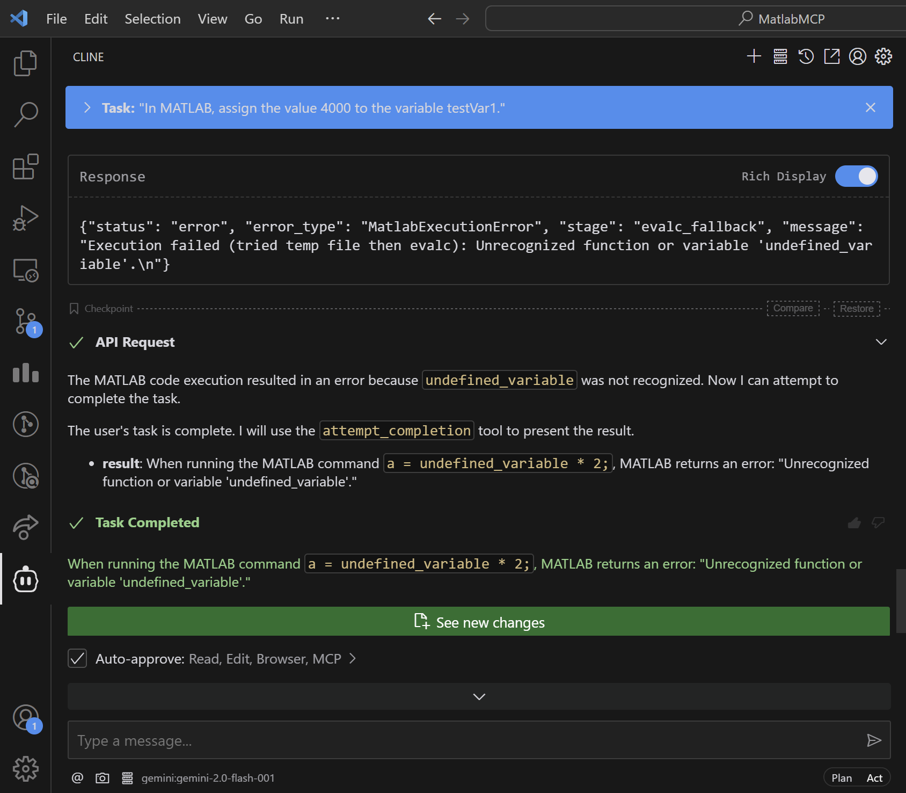
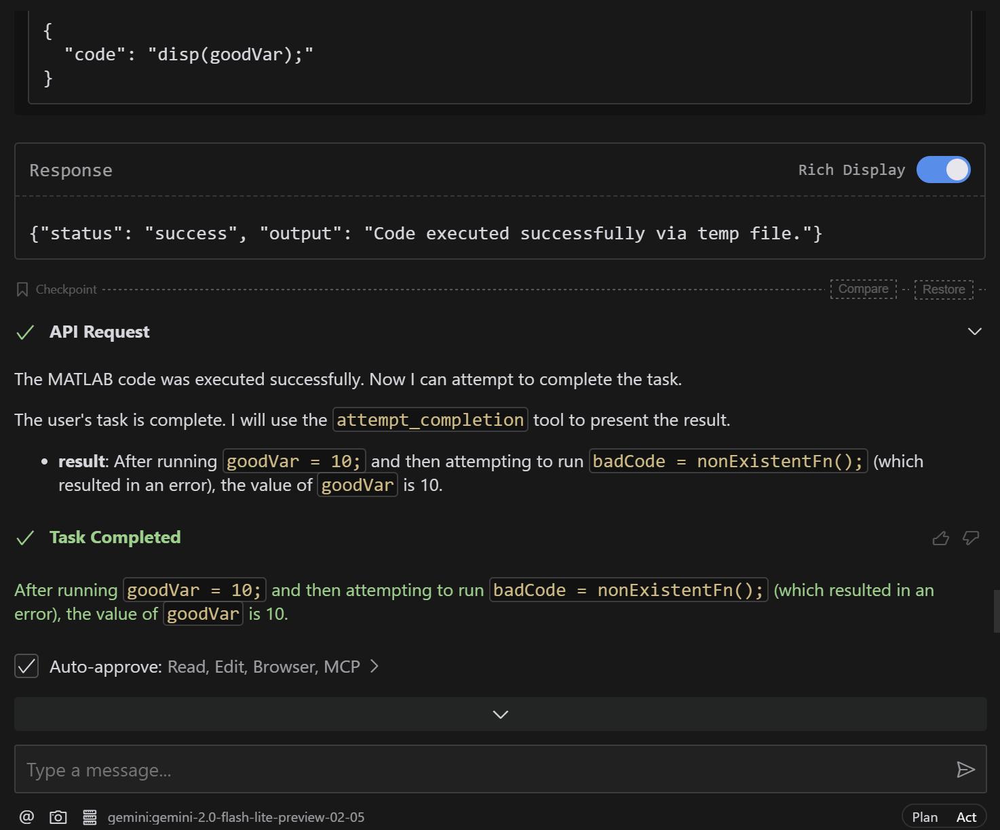
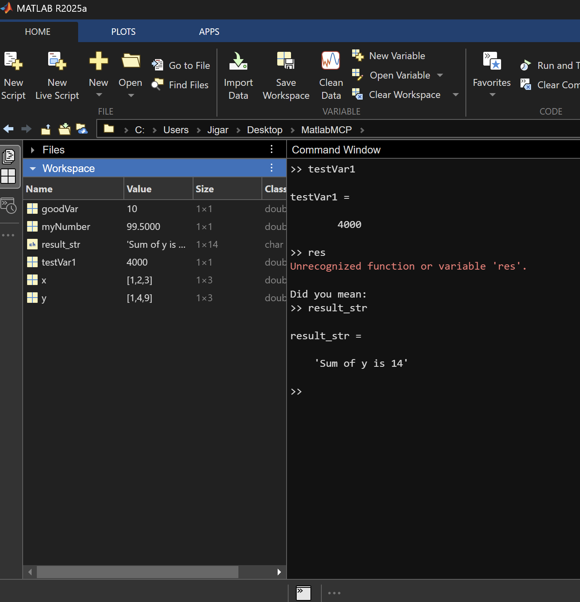

## 📸 MATLAB MCP - Demonstration Screenshots

### 🛠️ Tool Usage Request

**Claude requests to use an external tool.**

---

### 📈 Plot Generation

**MCP successfully generates a MATLAB plot.**

---

### 💻 MATLAB Command Execution

**Standard MATLAB command executed through MCP.**

---

### 🧠 Variable Assignment to Workspace

**Variables assigned to the MATLAB workspace from MCP.**

  

---

### 🧾 Multi-line Code Execution

**Execution of multi-line MATLAB scripts via MCP.**

  

---

### ❌ Execution Error Handling

**MCP handles MATLAB execution errors gracefully.**

  
  

---

### 📊 Other Functional Interactions

**Additional test cases and interactions.**

  

---

> ## ✅ And many more such successful test cases!
