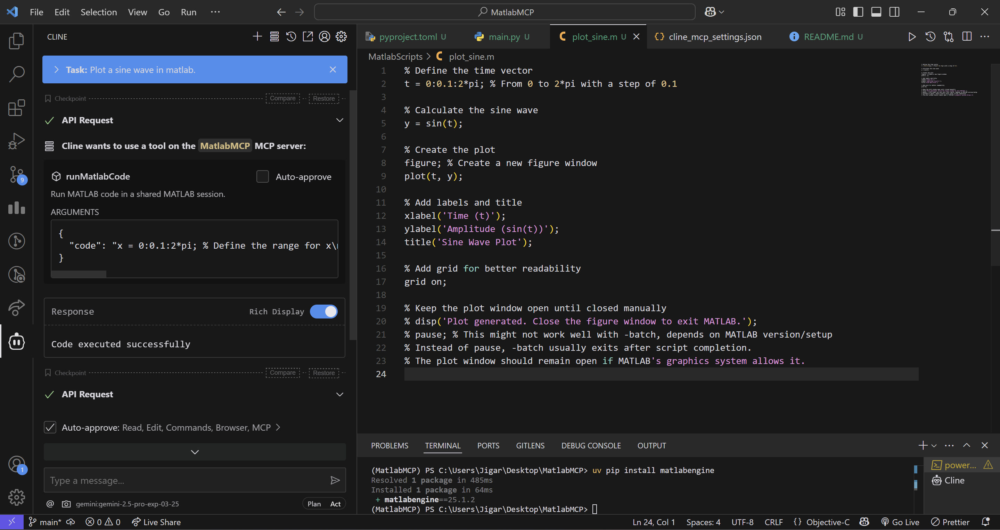
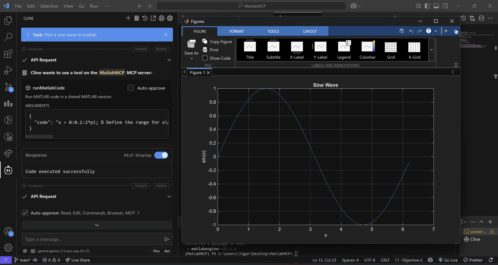

# MATLAB MCP Integration

This is simple implementation of Matlab MCP server. It allows you to run MATLAB code from Python using the MATLAB Engine API. The server listens for incoming requests and executes the provided MATLAB code in a shared MATLAB session.

## Features
- Execute MATLAB code from Python
- Share a single MATLAB session across multiple requests

### TODO:
 - Add support for Complex Simulink models
 - Add support for Simulink models with multiple inputs and outputs
 - Feed whole code files to MATLAB

 
## Requirements

- Python 3.12 or higher
- MATLAB (**2025a or higher**) with the MATLAB Engine API for Python installed

## Installation

1. Clone this repository:
   ```bash
   git clone <repository-url>
   cd MatlabMCP
   ```

2. Set up a Python virtual environment (optional but recommended):
   ```bash
   uv init
   uv venv
   .venv/bin/activate  # On Windows: .venv\Scripts\activate
   ```

3. Ensure MATLAB is installed and the MATLAB Engine API for Python is configured. Run the following in MATLAB to share the engine:
   ```matlab
   matlab.engine.shareEngine
   ```

   check if the engine is running:
   ```matlab
   matlab.engine.isEngineShared
   ```
   If it returns `false`, you need to start the engine manually. You can do this by running the previous command in the MATLAB command window.

## Configuration

To use it with Claude Desktop as intended you need to adjust your claude_desktop_config.json file. Go to Claude Desktop -> Settings -> Developer -> Edit Config. Now add the MatlabMCP server configuration.

```json
{
  "mcpServers": {
    "MatlabMCP": {
      "command": "C:\\Users\\username\\.local\\bin\\uv.exe",
      "args": [
        "--directory",
        "C:\\Users\\username\\MatlabMCP\\",
        "run",
        "main.py"
      ]
    }
  }
}
```
Make sure to adjust the paths to your local installation. The command should point to the uv executable and the args should point to the directory of this repository and the main.py file.

## Development

Project Structure:
```
MatlabMCP
├── .venv
├── .python-version
├── main.py
├── pyproject.toml
├── README.md
└── uv.lock
```

## Screenshots

*MatlabMCP running in the background*

---




*MatlabMCP output in matlab window*